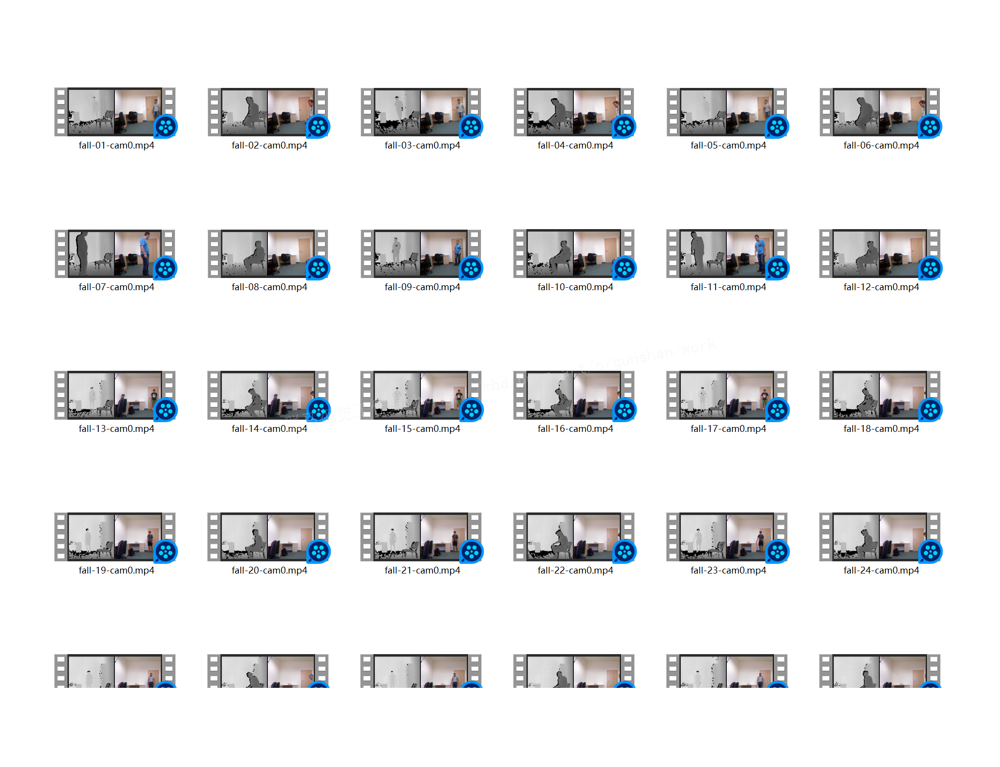
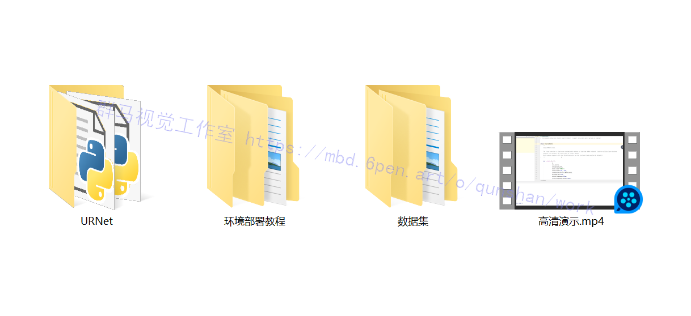

# 1.背景
随着当今社会老龄化的加快,老年人口比例越来越大,老年人的身体健康及安全问题逐渐成为家庭及社会关注的焦点。老年人跌倒是导致其伤残、失能甚至死亡的主要原因之一,老年人跌倒后不能及时发现并寻求帮助往往会使后果更加严重,鉴于跌倒对老人的伤害之大,一款能够准确检测老人跌倒的设备至关重要。基于计算机视觉的智能监控系统由于其实时性、成本低、可多任务并行等优点成为老人摔倒问题的研究热点。

# 2.图片演示


# 3.视频演示
[Python基于HRHet的跌倒检测系统（源码＆教程）_哔哩哔哩_bilibili](https://www.bilibili.com/video/BV11a411u7bT?spm_id_from=333.999.0.0&vd_source=bc9aec86d164b67a7004b996143742dc)


# 4.HRNet方法介绍
中科大和微软亚洲研究院，发布了新的人体姿态估计模型，刷新了三项COCO纪录，还中选了CVPR 2019。

这个名叫HRNet的神经网络，拥有与众不同的并联结构，可以随时保持高分辨率表征，不只靠从低分辨率表征里，恢复高分辨率表征。如此一来，姿势识别的效果明显提升：

在COCO数据集的关键点检测、姿态估计、多人姿态估计这三项任务里，HRNet都超越了所有前辈。


# 5.HRNet网络改进
[参考该博客](https://afdian.net/item?plan_id=f4b022305d8411edbe9752540025c377)，从高分辨率子网络(high-resolution subnetwork)作为第一阶段开始，逐步增加高分辨率到低分辨率的子网，形成更多的阶段，并将多分辨率子网并行连接。我们进行了多次多尺度融合multi-scale fusions，使得每一个高分辨率到低分辨率的表征都从其他并行表示中反复接收信息，从而得到丰富的高分辨率表征。因此，预测的关键点热图可能更准确，在空间上也更精确。通过 COCO keypoint detection 数据集和 MPII Human Pose 数据集这两个基准数据集的pose estimation results，我们证明了网络的有效性。此外，我们还展示了网络在 Pose Track 数据集上的姿态跟踪的优越性。

 二维人体姿态估计 2D human pose 是计算机视觉中一个基本而又具有挑战性的问题。目标是定位人体的解剖关键点(如肘部、腕部等)或部位。它有很多应用，包括人体动作识别、人机交互、动画(human action recognition, human-computer interaction, animation)等。本文着力于研究single-person pose estimation，这是其他相关问题的基础，如multiperson pose estimation[6,27,33,39,47,57,41,46,17,71]，video pose estimation and tracking[49,72]等。（引用的论文见博客最后，许多论文还是值得一读的）

最近的发展表明，深度卷积神经网络已经取得了最先进的性能。大多数现有的方法通过一个网络(通常由高分辨率到低分辨率的子网串联而成)传递输入，然后提高分辨率。例如，Hourglass[40]通过对称的低到高分辨率(symmetric low-to-high process)过程恢复高分辨率。SimpleBaseline[72]采用少量的转置卷积层(transposed convolution layers)来生成高分辨率的表示。此外，dilated convolutions还被用于放大高分辨率到低分辨率网络(high-to-low resolution network)的后几层[27,77](如VGGNet或ResNet)。

[该博客提出了一种新的架构](https://mbd.pub/o/bread/Y5aWmphs)，即高分辨率网络，它能够在整个过程中维护高分辨率的表示。我们从高分辨率子网作为第一阶段始，逐步增加高分辨率到低分辨率的子网(gradually add high-to-low resolution subnetworks)，形成更多的阶段，并将多分辨率子网并行连接。在整个过程中，我们通过在并行的多分辨率子网络上反复交换信息来进行多尺度的重复融合。我们通过网络输出的高分辨率表示来估计关键点。生成的网络如图所示。


# 6.跌倒数据集


通过视频流抠图demo转成数据集
代码如下：
```
import cv2
from numpy import *
import numpy as np

def resizeimg(img):
    height, width, channels = img.shape
    if width > 1500 or width < 600:
        scale = 1200 / width
        #print("图片的尺寸由 %dx%d, 调整到 %dx%d" % (width, height, width * scale, height * scale))
        scaled = cv2.resize(img, (0, 0), fx=scale, fy=scale)
    else:
        scaled = img
    return scaled

normal_file = './train3'
cap = cv2.VideoCapture("./3.mp4")
num = 0
num2 = 0
while(1):
    try:
        ret, frame = cap.read()
        num += 1
        if num == 10:
            num = 0
            num2 += 1
            cv2.imwrite(normal_file + "/" + str(num2) + '.jpg',frame, [int(cv2.IMWRITE_JPEG_QUALITY), 100])
    except:
        break
```
# 7.HRNet训练
#### experiments 目录下新建配置文件 eg: experiments/own/own_hrnet_w18.yaml
修改 DATASET中 ，ROOT、TRAINSET、TESTSET 目录路径 ，DATASET: 数据集名称
修改MODEL中 ，NUM_JOINTS: 对应自己训练集特征点数
```
DATASET:
  DATASET: OWN
  ROOT: '../data/own/images'
  TRAINSET: '../data/own/train.json'
  TESTSET: '../data/own/val.json'
  FLIP: true
  SCALE_FACTOR: 0.25
  ROT_FACTOR: 30
MODEL:
  NAME: 'hrnet'
  NUM_JOINTS: 37  // 根据自己数据集特征点数量
  INIT_WEIGHTS: true
  PRETRAINED: 'hrnetv2_pretrained/hrnetv2_w18_imagenet_pretrained.pth'
```
#### lib/datasets 中 新建 own.py 用于根据自己数据格式读取数据 拷贝 face300w.py内容, 修改类名和__getitem__方法
center,scale 计算公式
```
scale = max(w, h) / 200
center_w = (x1 + x2) / 2
center_h = (y1 + y2) / 2
```
根据自己格式读取. 我生成的是json格式.
```
def calCenterScale(self, bbox):
    w = bbox[2] - bbox[0]
    h = bbox[3] - bbox[1]
    center_w = (bbox[0] + bbox[2]) / 2.0
    center_h = (bbox[1] + bbox[3]) / 2.0
    scale = round((max(w, h) / 200.0), 2)
    return center_w, center_h, scale
    
def __getitem__(self, idx):
    image_path = os.path.join(self.data_root,
                                  self.landmarks_frame[idx]["image_path"])
    bbox = self.landmarks_frame[idx]['bbox']
    center_w, center_h, scale = self.calCenterScale(bbox)
    center = torch.Tensor([center_w, center_h])
    pts = np.array(self.landmarks_frame[idx]["keypoints"])
    pts = pts.astype('float').reshape(-1, 2)       
    ...
```
修改 lib/datasets/init.py 增加自己的数据集名称 (yaml 中设置的名称)
```
	from .aflw import AFLW
	from .cofw import COFW
	from .face300w import Face300W
	from .wflw import WFLW
	from .own import Own
	
	__all__ = ['AFLW', 'COFW', 'Face300W', 'WFLW', 'OWN', 'get_dataset']
	
	def get_dataset(config):
	    if config.DATASET.DATASET == 'AFLW':
	        return AFLW
	    elif config.DATASET.DATASET == 'COFW':
	        return COFW
	    elif config.DATASET.DATASET == '300W':
	        return Face300W
	    elif config.DATASET.DATASET == 'WFLW':
	        return WFLW
	    elif config.DATASET.DATASET == 'OWN':
	        return Own
	    else:
	        raise NotImplemented()
```
修改 lib/core/evaluation.py compute_nme 方法 ，增加自己的特征点数 取两个眼角下标。
```def compute_nme(preds, meta):
    targets = meta['pts']
    preds = preds.numpy()
    target = targets.cpu().numpy()

    N = preds.shape[0]
    L = preds.shape[1]
    rmse = np.zeros(N)

    for i in range(N):
        pts_pred, pts_gt = preds[i,], target[i,]
        if L == 19:  # aflw
            interocular = meta['box_size'][i]
        elif L == 29:  # cofw
            interocular = np.linalg.norm(pts_gt[8,] - pts_gt[9,])
        elif L == 68:  # 300w
            # interocular
            interocular = np.linalg.norm(pts_gt[36,] - pts_gt[45,])
        elif L == 98:
            interocular = np.linalg.norm(pts_gt[60,] - pts_gt[72,])
        elif L == 37:
            interocular = np.linalg.norm(pts_gt[0,] - pts_gt[15,])
        else:
            raise ValueError('Number of landmarks is wrong')
        rmse[i] = np.sum(np.linalg.norm(pts_pred - pts_gt, axis=1)) / (interocular * L)

    return rmse
```
修改 utils/transforms.py 中 fliplr_joints 方法 ( FLIP=false 无需改 )
** 据自己的特征点标注下标，如果从下标0开始标注，不需要 -1 ，类似 WFLW 数据集

#### 打开cmd输入
```
python scripts/train_coco.py --help
```
#### 开始训练
```
python scripts/train_coco.py --help
usage: train_coco.py [-h] [--exp_name EXP_NAME] [--epochs EPOCHS]
                     [--batch_size BATCH_SIZE] [--num_workers NUM_WORKERS]
                     [--lr LR] [--disable_lr_decay]
                     [--lr_decay_steps LR_DECAY_STEPS]
                     [--lr_decay_gamma LR_DECAY_GAMMA] [--optimizer OPTIMIZER]
                     [--weight_decay WEIGHT_DECAY] [--momentum MOMENTUM]
                     [--nesterov]
                     [--pretrained_weight_path PRETRAINED_WEIGHT_PATH]
                     [--checkpoint_path CHECKPOINT_PATH] [--log_path LOG_PATH]
                     [--disable_tensorboard_log] [--model_c MODEL_C]
                     [--model_nof_joints MODEL_NOF_JOINTS]
                     [--model_bn_momentum MODEL_BN_MOMENTUM]
                     [--disable_flip_test_images]
                     [--image_resolution IMAGE_RESOLUTION]
                     [--coco_root_path COCO_ROOT_PATH]
                     [--coco_bbox_path COCO_BBOX_PATH] [--seed SEED]
                     [--device DEVICE]

optional arguments:
  -h, --help            show this help message and exit
  --exp_name EXP_NAME, -n EXP_NAME
                        experiment name. A folder with this name will be
                        created in the log_path.
  --epochs EPOCHS, -e EPOCHS
                        number of epochs
  --batch_size BATCH_SIZE, -b BATCH_SIZE
                        batch size
  --num_workers NUM_WORKERS, -w NUM_WORKERS
                        number of DataLoader workers
  --lr LR, -l LR        initial learning rate
  --disable_lr_decay    disable learning rate decay
  --lr_decay_steps LR_DECAY_STEPS
                        learning rate decay steps
  --lr_decay_gamma LR_DECAY_GAMMA
                        learning rate decay gamma
  --optimizer OPTIMIZER, -o OPTIMIZER
                        optimizer name. Currently, only `SGD` and `Adam` are
                        supported.
  --weight_decay WEIGHT_DECAY
                        weight decay
  --momentum MOMENTUM, -m MOMENTUM
                        momentum
  --nesterov            enable nesterov
  --pretrained_weight_path PRETRAINED_WEIGHT_PATH, -p PRETRAINED_WEIGHT_PATH
                        pre-trained weight path. Weights will be loaded before
                        training starts.
  --checkpoint_path CHECKPOINT_PATH, -c CHECKPOINT_PATH
                        previous checkpoint path. Checkpoint will be loaded
                        before training starts. It includes the model, the
                        optimizer, the epoch, and other parameters.
  --log_path LOG_PATH   log path. tensorboard logs and checkpoints will be
                        saved here.
  --disable_tensorboard_log, -u
                        disable tensorboard logging
  --model_c MODEL_C     HRNet c parameter
  --model_nof_joints MODEL_NOF_JOINTS
                        HRNet nof_joints parameter
  --model_bn_momentum MODEL_BN_MOMENTUM
                        HRNet bn_momentum parameter
  --disable_flip_test_images
                        disable image flip during evaluation
  --image_resolution IMAGE_RESOLUTION, -r IMAGE_RESOLUTION
                        image resolution
  --coco_root_path COCO_ROOT_PATH
                        COCO dataset root path
  --coco_bbox_path COCO_BBOX_PATH
                        path of detected bboxes to use during evaluation
  --seed SEED, -s SEED  seed
  --device DEVICE, -d DEVICE
                        device
```

# 8.训练过程
```
Epoch: [0][0/916]	Time 18.342s (18.342s)	Speed 0.9 samples/s	Data 14.961s (14.961s)	Loss 0.00214 (0.00214)	
Epoch: [0][50/916]	Time 0.542s (0.880s)	Speed 29.5 samples/s	Data 0.000s (0.294s)	Loss 0.00076 (0.00085)	
Epoch: [0][100/916]	Time 0.537s (0.708s)	Speed 29.8 samples/s	Data 0.000s (0.148s)	Loss 0.00074 (0.00080)	
Epoch: [0][150/916]	Time 0.530s (0.650s)	Speed 30.2 samples/s	Data 0.000s (0.099s)	Loss 0.00075 (0.00079)	
Epoch: [0][200/916]	Time 0.531s (0.621s)	Speed 30.1 samples/s	Data 0.001s (0.075s)	Loss 0.00074 (0.00077)	
Epoch: [0][250/916]	Time 0.532s (0.603s)	Speed 30.1 samples/s	Data 0.000s (0.060s)	Loss 0.00072 (0.00077)	
Epoch: [0][300/916]	Time 0.525s (0.592s)	Speed 30.5 samples/s	Data 0.000s (0.050s)	Loss 0.00073 (0.00076)	
Epoch: [0][350/916]	Time 0.541s (0.583s)	Speed 29.6 samples/s	Data 0.000s (0.043s)	Loss 0.00071 (0.00075)	
Epoch: [0][400/916]	Time 0.536s (0.577s)	Speed 29.9 samples/s	Data 0.000s (0.038s)	Loss 0.00067 (0.00074)	
Epoch: [0][450/916]	Time 0.534s (0.572s)	Speed 30.0 samples/s	Data 0.000s (0.034s)	Loss 0.00057 (0.00073)	
Epoch: [0][500/916]	Time 0.534s (0.568s)	Speed 30.0 samples/s	Data 0.000s (0.030s)	Loss 0.00056 (0.00072)	
Epoch: [0][550/916]	Time 0.528s (0.565s)	Speed 30.3 samples/s	Data 0.000s (0.027s)	Loss 0.00055 (0.00071)	
Epoch: [0][600/916]	Time 0.533s (0.562s)	Speed 30.0 samples/s	Data 0.001s (0.025s)	Loss 0.00053 (0.00069)	
Epoch: [0][650/916]	Time 0.528s (0.560s)	Speed 30.3 samples/s	Data 0.000s (0.023s)	Loss 0.00051 (0.00068)	
Epoch: [0][700/916]	Time 0.535s (0.558s)	Speed 29.9 samples/s	Data 0.000s (0.022s)	Loss 0.00050 (0.00067)	
Epoch: [0][750/916]	Time 0.537s (0.556s)	Speed 29.8 samples/s	Data 0.000s (0.020s)	Loss 0.00053 (0.00066)	
Epoch: [0][800/916]	Time 0.532s (0.555s)	Speed 30.1 samples/s	Data 0.000s (0.019s)	Loss 0.00047 (0.00065)	
Epoch: [0][850/916]	Time 0.531s (0.554s)	Speed 30.1 samples/s	Data 0.000s (0.018s)	Loss 0.00051 (0.00064)	
Epoch: [0][900/916]	Time 0.526s (0.552s)	Speed 30.4 samples/s	Data 0.000s (0.017s)	Loss 0.00054 (0.00063)	
Train Epoch 0 time:0.5524 loss:0.0006 nme:0.3472
best: True
Test Epoch 0 time:0.3146 loss:0.0005 nme:0.1605 [008]:0.8482 [010]:0.5162
=> saving checkpoint to output\OWN\own_hrnet_w18
```

# 9.系统整合
下图[源码＆环境部署视频教程＆数据集＆自定义UI界面](https://s.xiaocichang.com/s/64b622)



# 10.参考文献
[1]基于SVM和阈值分析法的摔倒检测系统[J]. 陈玮,周晴,曹桂涛.  计算机应用与软件. 2017(07)
[2]图像阈值分割算法及对比研究[J]. 詹志宇,安友军,崔文超.  信息通信. 2017(04)
[3]基于核函数的非线性支持向量机[J]. 张立,王渊民.  科技展望. 2017(01)
[4]基于树莓派的物联网应用[J]. 刘继元.  电子世界. 2016(08)
[5]老年人跌倒检测系统的研究现状与发展趋势[J]. 高青,陈洪波,冯涛,朱振朋.  医疗卫生装备. 2015(12)
[6]基于OpenCV的老人跌倒检测的设计和实现[J]. 宋菲,薛质.  信息技术. 2015(11)
[7]基于树莓派B+微处理器的视频检测跟踪系统[J]. 高峰,陈雄,陈婉秋.  电视技术. 2015(19)
[8]行人检测中非极大值抑制算法的改进[J]. 陈金辉,叶西宁.  华东理工大学学报(自然科学版). 2015(03)
[9]一种基于改进差分的运动目标检测方法[J]. 季鸣,王红茹.  网络新媒体技术. 2015(03)
[10]基于嵌入式视频监控的摔倒检测系统的设计[J]. 白云飞,李瞡,何金龙.  电视技术. 2014(15)
[11]人体姿势状态判决的跌倒检测方法[J]. 沈秉乾,武志勇,贺前华,李磊.  计算机应用. 2014(S1)
[12]基于智能手机的人体跌倒检测系统设计[J]. 吴志强,曹蕾,王凯,吕庆文.  计算机工程与设计. 2014(04)
[13]行人检测技术研究综述[J]. 张春凤,宋加涛,王万良.  电视技术. 2014(03)
[14]基于智能视频监控的老人跌倒识别算法研究[J]. 万航,陈立潮,潘理虎,谢斌红,张英俊.  太原科技大学学报. 2013(04)
[15]浅析数学形态学在图像处理中的应用[J]. 肖大雪.  科技广场. 2013(05)
[16]中国老年人口的家庭居住、健康与照料安排——第六次人口普查数据分析[J]. 张翼.  江苏社会科学. 2013(01)
[17]基于三轴加速度传感器的人体跌倒检测系统设计与实现[J]. 王荣,章韵,陈建新.  计算机应用. 2012(05)
[18]一种可穿戴式跌倒检测装置设计[J]. 石欣,张涛.  仪器仪表学报. 2012(03)
[19]基于头部运动轨迹和3D视觉的跌倒检测系统[J]. 杨帆,谢靖,周余,王自强.  现代电子技术. 2012(02)
[20]基于HOG特征的行人视觉检测方法[J]. 程广涛,陈雪,郭照庄.  传感器与微系统. 2011(07)
[21]图像中基于滑动窗口的行人检测框架[J]. 彭源,杨娜,吴建国,田秀霞.  上海电力学院学报. 2011(01)
[22]支持向量机理论与算法研究综述[J]. 丁世飞,齐丙娟,谭红艳.  电子科技大学学报. 2011(01)
[23]基于惯性传感器件的跌倒检测系统设计[J]. 陈炜,佟丽娜,宋全军,葛运建.  传感器与微系统. 2010(08)
[24]中国农村老年人口照料现状分析[J]. 伍小兰.  人口学刊. 2009(06)
[25]图像分割及其常用的方法[J]. 王智,魏巍.  科技信息. 2008(26)
[26]支持向量机及其应用研究综述[J]. 祁亨年.  计算机工程. 2004(10)
[27]利用中值滤波进行图像处理[J]. 孙宏琦,施维颖,巨永锋.  长安大学学报(自然科学版). 2003(02)
[28]老年跌倒的疾病负担与危险因素[J]. 李林涛,王声湧.  中华流行病学杂志. 2001(04)

---
#### 如果您需要更详细的【源码和环境部署教程】，除了通过【系统整合】小节的链接获取之外，还可以通过邮箱以下途径获取:
#### 1.请先在GitHub上为该项目点赞（Star），编辑一封邮件，附上点赞的截图、项目的中文描述概述（About）以及您的用途需求，发送到我们的邮箱
#### sharecode@yeah.net
#### 2.我们收到邮件后会定期根据邮件的接收顺序将【完整源码和环境部署教程】发送到您的邮箱。
#### 【免责声明】本文来源于用户投稿，如果侵犯任何第三方的合法权益，可通过邮箱联系删除。